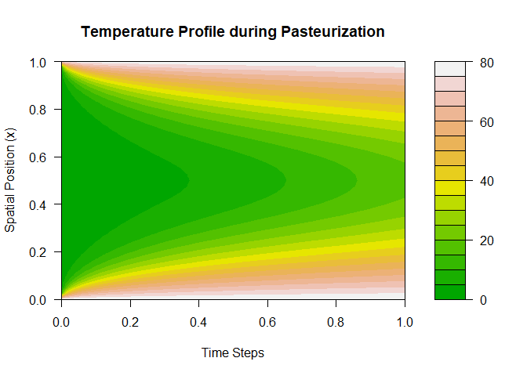

# pdeHeat

Le package **pdeHeat** est conçu pour modéliser et simuler la diffusion
de la chaleur en une dimension.

## Exemple d’utilisation

``` r
# Tout ce qui est ici est du code R
library(pdeHeat)

# 1. Initialisation de la grille
grid <- initialize_grid(L = 40, nx = 41, t = 1200)

# 2. Condition initiale
u0 <- initial_condition(grid$x, type = "constant", value = 4)

# 3. Résolution
bc <- list(left = 85, right = 85)
U <- solve_heat1d_cn(u0, L = 40, alpha = 0.12, dt = grid$dt, t = 1200, bc = bc)

# 4. Sécurité
check_safety(U, dt = grid$dt, threshold = 72, required_time = 15)
```

    ## Warning in check_safety(U, dt = grid$dt, threshold = 72, required_time = 15):
    ## Failure: Insufficient time above threshold (0s / 15s).

    ## $safe
    ## [1] FALSE
    ## 
    ## $duration_above
    ## [1] 0

``` r
plot_heat_map(U)
```

<!-- -->
